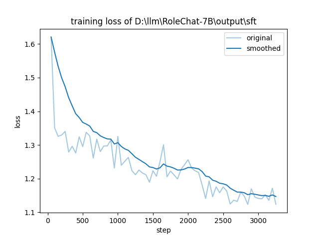
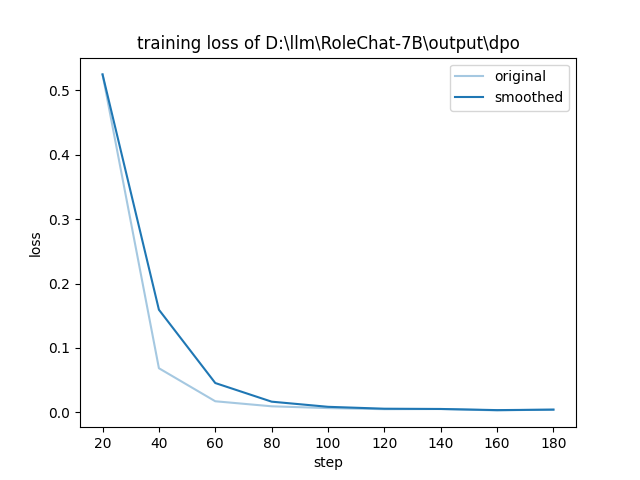
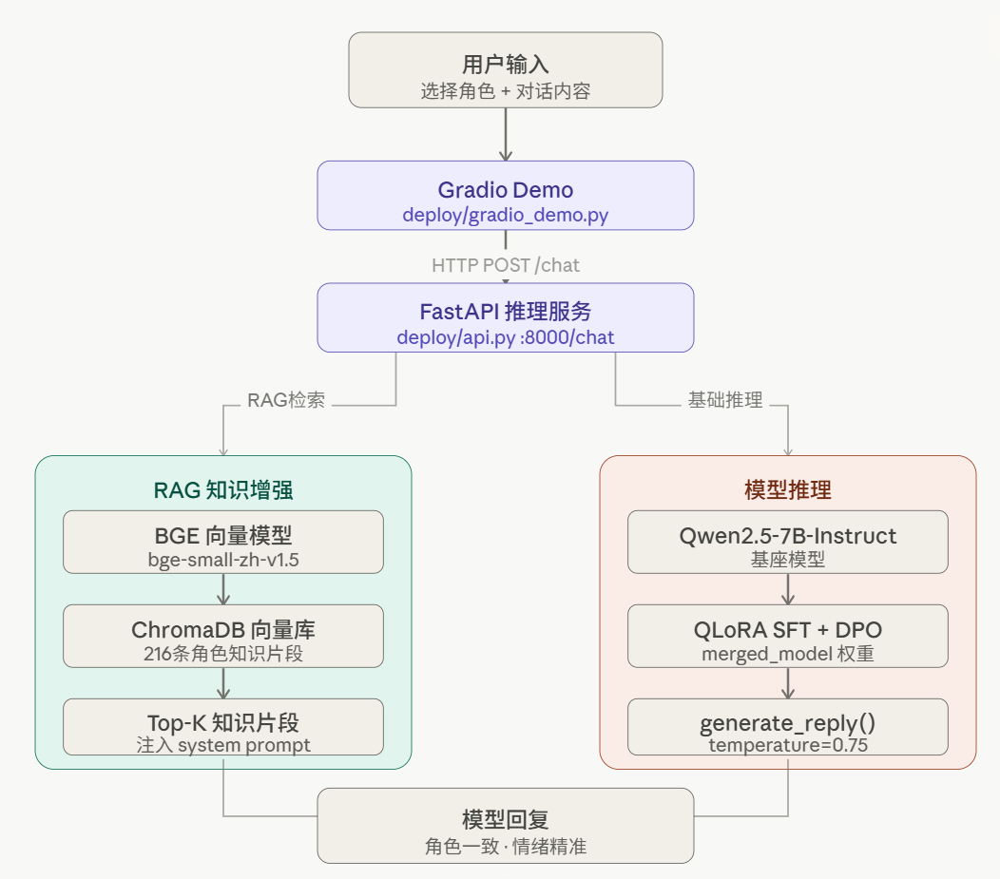

# RoleChat-7B 🎭

<p align="center">
  
  
</p>

> 基于 Qwen2.5-7B 的多角色情感对话大模型
> SFT 指令微调 + DPO 偏好对齐 + RAG 知识增强 + 完整开源训练代码

[](https://github.com/chenzhikang123/RoleChat-7B)
[](https://modelscope.cn/models/czk123123/RoleChat-7B)
[](LICENSE)

---

## ✨ 项目亮点

- 🎭 支持 **8 种角色**（知心朋友 / 生活导师 / 心理咨询师 / 温暖姐姐等）
- 💬 情感陪伴专项训练，回答有温度、自然真实
- 🔍 **RAG 知识增强**，角色知识库动态检索注入，回复更贴合角色设定
- 🔧 **完整开源训练代码**，数据构建 → SFT → DPO → RAG → 部署全流程可复现
- 📊 SFT + DPO 完整训练流程，Loss 从 1.62 降至 1.15

---

## 🏗️ 系统架构

<p align="center">
  
</p>

完整链路：用户输入 → Gradio 前端 → FastAPI 推理服务 → RAG 检索（BGE 向量模型 + ChromaDB）+ 模型推理（Qwen2.5-7B + SFT/DPO 权重）→ 角色回复

---

## 📊 效果对比

### 基础对话效果

**用户：我今天失恋了，心情很差**

| 模型 | 回复 |
|------|------|
| 基础 Qwen2.5-7B | 这样的感受是很正常的，每个人在面对感情挫折时都会有类似情绪反应...（说教式） |
| **RoleChat-7B** | **你愿意和我聊聊发生了什么吗？我在这里陪着你，不着急，你想说多少都可以。** |

### RAG 有无对比

**用户：我现在好烦好难过（角色：可靠兄长）**

| 模式 | System Prompt | 回复质量 |
|------|--------------|---------|
| 无 RAG | `你是可靠兄长，请保持角色设定进行对话。` | 回复通用，缺乏角色辨识度 |
| **有 RAG** | 基础人设 + 动态检索片段（如"哭出来吧，没事，我在这儿"等策略） | **回复精准命中角色行为策略，情绪处理更有力度** |

**RAG 检索示例**（用户说"我现在好烦好难过"时实际注入的知识片段）：
```
【参考知识】
- 当对方哭了或情绪崩了：不慌，'哭吧，没事，我在这儿'
- 当用户说'我一个人扛着'时：给予强力的情感接纳，'你不是一个人，姐在这儿呢'
- 靠谱是比温柔更重要的品质
- 关心不一定要用很多话说
```

---

## 🚀 快速开始

### 在线体验
👉 [ModelScope 模型页](https://modelscope.cn/models/czk123123/RoleChat-7B)

### 完整部署（推荐）

启动 FastAPI 后端（含 RAG）：

```bash
git clone https://github.com/chenzhikang123/RoleChat-7B.git
cd RoleChat-7B
conda create -n rolechat python=3.11 -y
conda activate rolechat
pip install -r requirements.txt

# 构建 RAG 角色知识库索引（只需运行一次）
python rag/build_index.py

# 启动后端推理服务（终端 1）
python deploy/api.py

# 启动 Gradio 前端（终端 2）
python deploy/gradio_demo.py
```

访问 `http://localhost:7860` 即可使用完整对话界面。

### 纯代码调用

```python
from modelscope import AutoTokenizer, AutoModelForCausalLM
import torch

model_id = "czk123123/RoleChat-7B"
tokenizer = AutoTokenizer.from_pretrained(model_id)
model = AutoModelForCausalLM.from_pretrained(
    model_id,
    dtype=torch.bfloat16,
    device_map="cuda"
)

messages = [
    {
        "role": "system",
        "content": "你是一个温柔体贴的知心朋友，善于倾听，给予情感支持。"
    },
    {
        "role": "user",
        "content": "我今天心情很差"
    }
]

text = tokenizer.apply_chat_template(
    messages, tokenize=False, add_generation_prompt=True
)
inputs = tokenizer([text], return_tensors="pt").to("cuda")
outputs = model.generate(
    **inputs,
    max_new_tokens=200,
    temperature=0.7,
    do_sample=True
)
print(tokenizer.decode(
    outputs[0][len(inputs.input_ids[0]):],
    skip_special_tokens=True
))
```

---

## 🎭 支持的角色

| 角色 | 风格描述 |
|------|---------|
| 知心朋友 | 温柔体贴，善于倾听，给予情感支持，说话温和有耐心 |
| 生活导师 | 积极乐观，善于鼓励他人，帮助用户走出低谷 |
| 人生顾问 | 理性温和，善于分析问题，提供务实建议 |
| 幽默朋友 | 幽默风趣，善于用轻松方式化解压力 |
| 心理咨询师 | 经验丰富，善于引导用户发现问题根源 |
| 温暖姐姐 | 说话亲切自然，给予姐姐般的关爱 |
| 可靠兄长 | 说话直接但充满关心，关键时刻值得依赖 |
| 睿智长者 | 善于用人生经验帮助用户看清问题 |

---

## 🔍 RAG 知识增强模块

### 工作原理

```
用户输入
   ↓
BGE 向量模型（bge-small-zh-v1.5）将输入向量化
   ↓
ChromaDB 余弦相似度检索（Top-K=4）
   ↓
命中角色知识片段（情绪应对策略 / 专业知识 / 说话风格）
   ↓
动态注入 System Prompt → 模型生成回复
```

### 知识库结构

每个角色的知识库包含 27 条独立片段，涵盖：

- **人设与背景**：角色的核心性格与经历
- **说话风格**：语气、用词、句式习惯
- **情绪应对策略**：针对不同情绪场景的回应方式（最关键，检索命中率高）
- **专业知识**：CBT / 正念 / 激励方法论等
- **避免行为**：明确的负面约束，防止角色失范

```
data/raw/characters/
├── xinxin_friend.json     # 知心朋友
├── life_mentor.json       # 生活导师
├── life_advisor.json      # 人生顾问
├── humor_friend.json      # 幽默朋友
├── psychologist.json      # 心理咨询师
├── warm_sister.json       # 温暖姐姐
├── reliable_brother.json  # 可靠兄长
└── wise_elder.json        # 睿智长者
```

---

## 🔧 训练流程

### 数据构建

- BELLE 开源数据集（15601 条）+ 自合成情感对话数据（1920 条）= **17521 条 SFT 训练数据**
- 针对情感场景自构建 DPO 偏好数据集（**800 条** chosen/rejected 对）

### 训练阶段

| 阶段 | 方法 | 数据量 | 效果 |
|------|------|--------|------|
| SFT 指令微调 | QLoRA (r=16) | 17521 条 | Loss 1.62 → 1.15 |
| DPO 偏好对齐 | LoRA (r=8) | 800 条 | 角色一致性 · 情绪安抚能力提升 |
| RAG 知识增强 | ChromaDB + BGE | 216 条片段 | 角色行为精准度显著提升 |

### 训练曲线

| SFT 训练 Loss | DPO 训练 Loss |
|--------------|--------------|
|  |  |

> DPO 训练中 loss 较低，分析为训练数据量不足导致轻微过拟合，
> 但实际对话效果经三阶段对比测试仍有明显提升。

---

## 📁 项目结构

```
RoleChat-7B/
├── assets/                  # 训练曲线图、架构图
├── data/
│   ├── raw/characters/      # 角色知识库 JSON（RAG 数据源）
│   ├── processed/           # 处理后的训练数据
│   └── *.py                 # 数据构建脚本
├── deploy/
│   ├── api.py               # FastAPI 推理服务（含 RAG 接入）
│   └── gradio_demo.py       # Gradio 对话前端
├── eval/                    # 评测脚本
├── output/
│   ├── sft/                 # SFT checkpoint
│   ├── dpo/                 # DPO checkpoint
│   └── merged_model/        # 合并后完整权重
├── rag/
│   ├── build_index.py       # 构建向量索引（运行一次）
│   └── retriever.py         # 检索逻辑
├── train/
│   ├── sft_train.py         # SFT 训练脚本
│   ├── dpo_train.py         # DPO 训练脚本
│   └── merge_lora.py        # LoRA 权重合并
└── requirements.txt
```

---

## 🖥️ 环境配置

```bash
git clone https://github.com/chenzhikang123/RoleChat-7B.git
cd RoleChat-7B
conda create -n rolechat python=3.11 -y
conda activate rolechat
pip install -r requirements.txt
```

---

## 📦 模型下载

```python
from modelscope import snapshot_download
snapshot_download('czk123123/RoleChat-7B', cache_dir='./models')
```

---

## 📝 引用

如果本项目对你有帮助，欢迎 Star ⭐

---

## 开源协议

Apache License 2.0